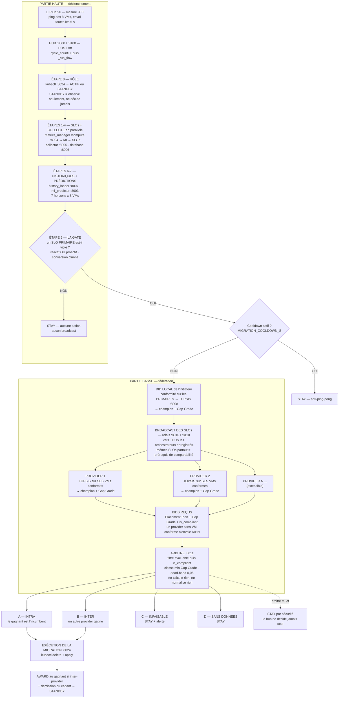
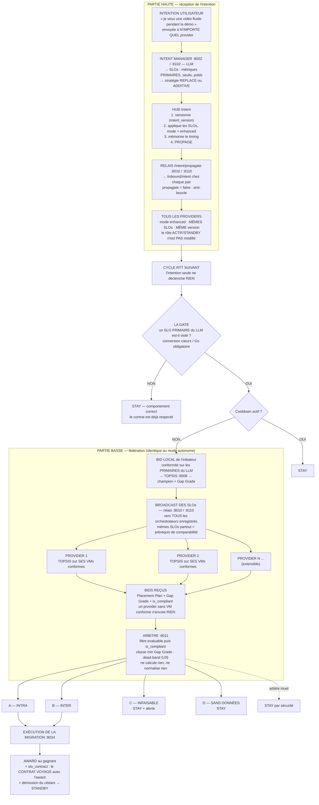

# État d'avancement et pipeline de décision — 04-08-2026

Document de référence produit à l'issue de la session du **04-08-2026**, faisant
suite à l'état consigné au 03-08-2026 (`SUIVI_ARBITRAGE_FEDERE.md`).

1. [Décisions de la réunion du 28-07-2026](#0-décisions-de-la-réunion-du-28-07-2026)
2. [Travaux de la session](#1-travaux-de-la-session-du-04-08-2026)
3. [Ce qui distingue les deux modes](#2-ce-qui-distingue-les-deux-modes)
4. [**Pipeline — mode AUTONOME**](#3-pipeline--mode-autonome) + détail de chaque étape
5. [**Pipeline — mode ENHANCED**](#4-pipeline--mode-enhanced) + détail de chaque étape
6. [Invariants verrouillés](#5-invariants-verrouillés)
7. [Dettes restantes](#6-dettes-restantes)
8. [Séquence de lancement](#7-séquence-de-lancement)

> **À compléter** — les décisions de la réunion du **28-07-2026** ne figurent pas
> ici : elles n'étaient pas disponibles au moment de la rédaction.

---

## 0. Décisions de la réunion du 28-07-2026

_(à remplir)_

---

## 1. Travaux de la session du 04-08-2026

Treize lots, chacun appliqué puis **relu indépendamment dans le code**. Les
**354 tests** passent après chaque lot. Rien n'est committé.

### Règles de décision

| # | Lot | Problème corrigé |
|---|---|---|
| 1 | **CAS B — plus d'offre non conforme** | Un provider sans VM conforme proposait sa « moins mauvaise » VM. Il ne propose plus **rien**. |
| 2 | **Conformité restreinte aux primaires** | `_applicable_slos` ne filtrait pas `is_primary` : un secondaire (issu du MI, seuil = percentile local) pouvait **disqualifier** une VM conforme au contrat et — combiné au lot 1 — réduire un provider entier au silence. |

### Rôle actif / standby

| # | Lot | Problème corrigé |
|---|---|---|
| 3 | **Fenêtre de grâce après award** | `_sync_active_vm` démettait un provider **fraîchement promu** en lisant un état kubectl périmé → fenêtre « deux standby ». `AWARD_GRACE_PERIOD_S = 15 s` : pendant cette fenêtre, une lecture contredisant l'award est **entièrement ignorée**. |
| 4 | **`role` / `hosting_vm` exposés** | `/data` ne les exposait pas → dashboard d'un standby vide. Ajout des champs + badge `RÔLE STANDBY` + bannière. |

### Communication

| # | Lot | Problème corrigé |
|---|---|---|
| 5 | **Push hub → bridge PiCar** | Le bridge retombait sur la VM **canonique** de kubectl (`edge2` au lieu de `edge2b`) dès qu'un hub tardait. Le hub ACTIF pousse son état à `POST /active-vm-push`. |
| 6 | **Propagation d'intention** | Une intention envoyée à un STANDBY n'avait **aucun effet**. Trois mécanismes : propagation immédiate, **versionnement** (`intent_version`), **réconciliation à l'award**. |

### Mode enhanced — quatre défauts, une même famille

Cause commune : le LLM exprime le contrat en **unités absolues** (`cœurs`, `Go`),
le collector et le ML rapportent des **pourcentages**.

| # | Lot | Symptôme mesuré | Après |
|---|---|---|---|
| 7 | Conversion d'unité dans **LA GATE** (proactif) | `any(50.4 < 0.6)` → **jamais vrai** : un primaire cpu/ram ne pouvait **jamais** déclencher de migration | `0.72 cœur < 1.0` → ouverte ✅ · `2.0 ≥ 1.0` → fermée ✅ |
| 8 | **`_is_violation`** (réactif) | Pas de conversion **et** opérateur du registre (`<`) au lieu du SLO (`>=`) → **violation déclarée sur toute VM saine, à chaque cycle** | VM saine → `False` ✅ |
| 9 | **Clamp en % sur seuil absolu** | `0.5 cœur` borné par `min = 1.0` (un **pourcentage**) → contrat **doublé**. Cible de détection aussi inversée pour les critères de bénéfice | `cpu >= 0.500`, cible `0.55` ✅ |
| 10 | **Secondaires promus en primaires** | Le hub renvoyait tout `current_slos` à `/validate`, dont les secondaires MI ; l'étape 1 force `is_primary = True` → promotion en cascade. Une intention à **1 SLO** finissait avec **3 primaires** | `latency < 30` seul primaire, Σ poids = `1.0000` ✅ |

### Outillage

| # | Lot | Contenu |
|---|---|---|
| 11 | `EXCEL_PATH` par provider | Les deux stacks écrasaient le même classeur (`Bad magic number`, perte de `Intentions_LLM`). |
| 12 | `federation_view` — pilotage | Panneau de contrôle (intention vers le provider **choisi**, retour autonomous sur **tous**) + synthèse par provider. |
| 13 | `federation_view` — allègement | Section pédagogique retirée, `REFRESH_MS` 2000 → 750, timeout 3 s → 5 s. |

---

## 2. Ce qui distingue les deux modes

**Les deux modes partagent le même moteur.** `_step8_decide` appelle
`_decide_federated` sans jamais consulter `state._mode`. Seules **trois** choses
diffèrent :

| | `autonomous` | `enhanced` |
|---|---|---|
| **Origine des SLOs** | calculés par `metrics_manager /compute` | dictés par une intention (LLM), validés par `/validate` |
| **Propagation** | aucune — dérivés localement | l'intention est propagée à **tous** les providers |
| **Mesures Excel** | une ligne **par cycle** | une ligne **par intention** |

Tout le reste — gate, bid local, broadcast, TOPSIS, Gap Grade, arbitrage,
migration, award — est **strictement identique**.

---

## 3. Pipeline — mode AUTONOME



### Détail de chaque étape

#### ⓪ Rôle — `_sync_active_vm`

- **Qui** : le hub interroge `openstack_client :8024 /active_vm`
- **Quand** : sur violation, **ou** tous les `ACTIVE_VM_SYNC_EVERY_N_CYCLES` (10)
  cycles — appeler kubectl coûte cher (sous-processus sur le master)
- **Règle** : `is_active = (PROVIDER_OF_VM[active_vm] == PROVIDER_ID)`
- **Piège de granularité** : kubectl résout au **NŒUD**, pas à la VM. Il renvoie
  toujours la VM **canonique** (`edge1` pour `edge1`/`edge1b`/`edge1c`). On
  n'adopte sa valeur que si notre suivi local n'est pas plus précis.
- **Depuis le lot 3** : pendant les 15 s suivant un award reçu, une lecture
  kubectl qui contredirait l'award est **entièrement ignorée**.
- **Un STANDBY ne décide jamais** : `_step8_decide` sort immédiatement.

#### ① SLOs — `metrics_manager /compute` (:8004)

Construit les SLOs à partir de l'historique de la VM de service :

- **Primaire** — la métrique `is_primary_objective` du `METRICS_REGISTRY` : la
  **latence**, seuil métier **fixe** `40 ms`, jamais recalculé.
- **Secondaires** — pour chaque autre métrique, calcul de
  **MI(métrique ; signal de violation)** : estimateur **Kozachenko-Leonenko
  k-NN** sur entropie différentielle, normalisé par `H(Y)` → `[0, 1]`. Si
  `MI > 0.15`, création d'un SLO **secondaire** — seuil par **percentile
  adaptatif**, poids = score MI.
- **Normalisation** : `Σ poids = 1`.
- Pendant les 5 premiers cycles (bootstrap) : primaires uniquement.

> **Pourquoi les SLOs peuvent différer entre providers** : le primaire est
> identique partout (seuil fixe). Les secondaires dépendent du MI, calculé sur
> l'historique de **la VM active de chaque provider**. Sans effet sur les
> décisions : l'initiateur diffuse **ses** SLOs au moment de la fédération.

#### ②-④ Persistance et collecte — `collector :8005`, `database :8006`

`collector` interroge les 8 agents VM en parallèle (cpu, ram, capacité
déclarée `total_cores` / `total_ram_gb`). Fusion avec les RTT reçus, persistance
Redis + Excel. Les étapes ①-② et ③-④ tournent **en parallèle** (elles ne
dépendent pas l'une de l'autre).

#### ⑥-⑦ Historiques et prédictions — `history_loader :8007`, `ml_predictor :8003`

50 points d'historique par VM, puis **7 prédictions par métrique et par VM**
(cascade GRU, 3 APIs externes : latence :5001, cpu :5002, ram :5003).

#### ⑤ LA GATE — `_step5_check_violations`

Le cœur du déclenchement. Calculée **à chaque cycle**, dans les deux modes.

```
violation_réactive = _is_violation(mesure_actuelle, seuils)   ← filet « ML down »
signal_proactif    = any(prédiction dépasse le seuil)         ← sur les 7 horizons
GATE = violation_réactive OU signal_proactif_sur_un_PRIMAIRE
```

Trois propriétés :

1. **Seuls les SLOs `is_primary` ouvrent la gate.** Un secondaire est loggué mais
   ne déclenche jamais rien.
2. **`any(...)` sur les 7 prédictions** — une seule qui dépasse suffit. La gate
   est donc **plus sensible** que le test de conformité, qui porte sur une valeur
   agrégée.
3. **Conversion d'unité obligatoire** (lots 7-8) : la valeur prédite en `%` est
   convertie dans l'unité du SLO via `to_slo_unit` avant comparaison.

**Gate fermée → `STAY`.** Aucun broadcast, aucun appel réseau. C'est le cas
majoritaire, et c'est ce qui rend le système sobre.

#### Cooldown

Vérifié **avant** toute évaluation : une migration récente (`MIGRATION_COOLDOWN_S`)
bloque tout nouveau tour. Garde-fou anti-ping-pong.

#### Bid local — `_build_local_bid`

Chaque provider évalue **ses propres VMs** (isolation totale : il ne voit jamais
celles de l'autre) contre les **SLOs reçus**.

| Cas | Condition | Champion | `is_compliant` |
|---|---|---|---|
| **A** | ≥ 1 VM conforme aux **primaires** | **TOPSIS** départage les conformes | `true` |
| **B** | aucune VM conforme | **aucun** (`vm_id = null`) — lot 1 | `false` |
| **C** | rien d'évaluable | aucun | `evaluable = false` |

**Conformité (lot 2)** — une VM est conforme si **tous les SLOs `is_primary`**
sont satisfaits, avec conversion d'unité. Les secondaires **ne participent pas** :
ils alimentent `violation_score` et pondèrent TOPSIS, rien de plus.

> **Exception du cas A** : la VM **incumbente** (celle en violation) est
> délibérément injectée dans le pool TOPSIS, sinon `decision_intelligence`
> court-circuite le calcul.

#### TOPSIS — `decision_intelligence :8008`

Départage **intra**-provider, sur les VMs conformes, avec **tous** les SLOs
(primaires **et** secondaires) et leurs poids :

1. **Matrice** — moyenne pondérée des 7 prédictions ; `cpu`/`ram` convertis en
   **disponibilité absolue** : `capacité × (1 − usage%/100)`
2. **Normalisation min-max** — colonne par colonne
3. **Pondération** — par les poids des SLOs
4. **Idéaux** `A⁺`/`A⁻` — latence = **coût** (min idéal), cpu/ram = **bénéfices**
   (max idéal)
5. **Distances** euclidiennes, score `d⁻/(d⁺+d⁻)` — le plus haut gagne

> ⚠️ **Les scores TOPSIS ne sont PAS comparables entre providers** : la
> normalisation min-max est relative au pool. Le meilleur d'un pool vaut toujours
> ≈ 1.0, le pire ≈ 0.0, quelles que soient les valeurs absolues.

#### Gap Grade (Tchebycheff) — `compute_gap_grade`

Calculé sur le **champion** élu, avec les **primaires uniquement** :

```
① filtrer les primaires
② écarts signés     δ = (v − τ)/τ   (coût)      δ = (τ − v)/τ   (bénéfice)
③ plancher          δ ≥ −1          (DELTA_FLOOR)
④ normaliser        wₙₒᵣₘ = wᵢ / Σw  (Σ = 1 sur les primaires retenus)
⑤ Tchebycheff       G = ( max(wₙₒᵣₘ·δ) + ρ·Σ(wₙₒᵣₘ·δ) ) / (1 + ρ)     ρ = 0,1
```

- **Comparable entre providers** — normalisé par les **seuils SLO globaux**,
  partagés par tous. C'est la **seule** grandeur qui traverse la frontière.
- **Non compensatoire** — le `max()` retient le **pire** critère pondéré ; un
  excédent ailleurs ne peut jamais le racheter. Le terme `ρ·Σ` ne sert qu'à
  départager deux VMs à égalité sur leur pire critère.
- **Signe** : `G < 0` = conforme avec marge · `G > 0` = viole.
- **Non-régression** : avec un seul primaire, `G = δ` exactement.

#### Broadcast — `provider_relay :8010` / `:8110`

L'initiateur diffuse `{slos, intent_id, incumbent_vm, from_provider}` à **tous**
les pairs en parallèle (`scatter-gather`). Chaque pair construit son bid via
`/inbound/evaluate` → son hub local `/evaluate`.

**Dégradation gracieuse** : un pair injoignable alimente `errors` sans faire
échouer le tour. Relais injoignable → on poursuit avec le seul bid local.

#### Arbitrage — `placement_arbiter :8011`

Microservice **sans état, sans réseau sortant**. Il **ne calcule rien** : il
compare des Gap Grades déjà calculés à la source.

```
⓪ FILTRE (ordre critique)
   a) evaluable == true          ← TOUJOURS testé en premier
   b) gap_grade présent
   c) vm_id présent
   d) si SLO_ENFORCEMENT == "hard" : is_compliant == true

② CLASSEMENT   Gap Grade CROISSANT (le plus petit gagne)
③ DEAD-BAND    si le meilleur n'est pas l'incumbent, il doit le battre
               de plus de 0,05 — sinon l'incumbent est protégé
④ DÉPARTAGE    ordre du registre de providers
```

> Le test (a) **doit** précéder (d) : un provider dont aucune VM n'est évaluable
> renvoie `is_compliant = true` par la neutralité « ML down ». Tester la
> conformité d'abord ferait gagner l'enchère à un provider **aveugle**.

**Chemins** : `A` = le gagnant est l'incumbent · `B` = un autre provider gagne ·
`C` = aucun bid retenu mais des bids étaient évaluables (INFAISABLE) · `D` =
aucun bid évaluable (SANS DONNÉES).

**Arbitre injoignable → `STAY`.** Le hub ne décide jamais seul.

#### Migration, award, démission

1. `database /store/decision`
2. `openstack_client :8024 /migrate` — `kubectl delete` puis `apply` avec le bon
   `nodeSelector`
3. **Award** — si le gagnant est un **autre** provider, on le notifie de la VM
   **précise** retenue (kubectl ne connaîtrait que la canonique)
4. **Démission** — le cédant passe `is_active = False`, immédiatement et
   **inconditionnellement** : entre « deux actifs » (migrations concurrentes) et
   « deux standby » (personne ne décide pendant quelques cycles), le second est
   strictement moins dangereux.

### Exemple chiffré — mode autonome

**SLOs** : `latency < 40 ms` (P, w 0,45) · `cpu ≥ 1,0 cœurs` (S, w 0,29) ·
`ram ≥ 1,0 Go` (S, w 0,26). Service sur `edge2c`, provider-2 actif.

**Gate** : prédictions latence `edge2c` = `[41, 44, 42, 43, 45, 44, 43]` → pire
cas 45 > 40 → **ouverte**.

**Bid provider-2**

| VM | latence | cpu | ram | conforme (primaire seul) |
|---|---|---|---|---|
| edge2 | 58 | 0,44 | 0,63 | ❌ |
| **edge2b** | 37 | 1,50 | 1,49 | ✅ |
| edge2c *(incumbent)* | 44 | 1,76 | 1,60 | ❌ |
| **cloud2** | 33 | 6,10 | 6,31 | ✅ |

TOPSIS → **cloud2** (score 1,000) · Gap Grade `δ = (33−40)/40` → **G = −0,1750**

**Bid provider-1**

| VM | latence | cpu | ram | conforme |
|---|---|---|---|---|
| edge1 | 43 | 0,46 | 0,69 | ❌ |
| **edge1b** | 28 | 1,24 | 1,00 | ✅ |
| **edge1c** | 36 | 1,99 | **0,80** | ✅ ⚠️ |
| cloud1 | 96 | 6,61 | 6,77 | ❌ |

⚠️ `edge1c` a un **secondaire en défaut** (`ram 0,80 < 1,0`). **Avant le lot 2
elle était exclue** ; désormais elle concourt.

TOPSIS → **edge1b** (0,642) · Gap Grade `(28−40)/40` → **G = −0,3000**

**Arbitrage** : meilleur = provider-1 (−0,3000), qui n'est pas l'incumbent →
dead-band : `−0,3000 < −0,1750 − 0,05` ✅
→ **MIGRATE · chemin B · `edge2c → edge1b`** · award à provider-1 · provider-2
passe STANDBY.

---

## 4. Pipeline — mode ENHANCED



### Détail de chaque étape

#### ① L'intention arrive — `intent_manager :8002` / `:8102`

Le client envoie du **langage naturel** à **n'importe quel** provider. Il ne sait
pas — et n'a pas à savoir — lequel héberge le service : c'est le principe de
**transparence à la localisation**.

Le LLM (Qwen3 via LAAS, repli Ollama) produit :
- une liste de **SLOs primaires** : métrique, opérateur, seuil, unité, **poids**
- une **stratégie de fusion** : `REPLACE` (remplacer les SLOs actifs) ou
  `ADDITIVE` (les compléter)

#### ② Le hub reçoit — `POST /intent`

Quatre actions, et **rien d'autre** :

1. **Versionnement** — `intent_version = time.time()` si absente. Les hubs
   tournant sur la **même machine**, l'horodatage est directement comparable ; il
   n'y a aucune dérive d'horloge à arbitrer. Une intention **plus ancienne** que
   celle déjà appliquée est **rejetée** (`status: stale`).
2. **Application** — remplace `current_slos`, fige `original_intent_weights` (les
   poids d'origine du LLM, pour éviter la **dilution cumulative** cycle après
   cycle), bascule `_mode = "enhanced"`.
3. **Timing** — mémorise la durée de réception, consommée par le cycle qui
   exécutera la migration (ligne Excel « par intention »).
4. **Propagation** — `POST /intent/propagate` au relais, en fire-and-forget.

> ⚠️ **Recevoir une intention ne promeut JAMAIS un standby en actif.** Le rôle
> vient uniquement de kubectl. Sinon on aurait deux actifs et deux migrations
> concurrentes sur le même pod.

#### ③ Propagation — `relais /intent/propagate` → `/inbound/intent`

Diffusion **parallèle** à tous les pairs. Chaque relais pair livre le payload à
**son** hub local sur `/intent`, en forçant `propagate: false`.

**Anti-boucle** : sans cette garde, A propagerait à B qui repropagerait à A
indéfiniment.

**Dégradation gracieuse** : un pair injoignable alimente `errors`, l'appel
réussit quand même. Le filet de sécurité est la réconciliation à l'award (⑦).

**Résultat** : tous les providers ont le **même contrat**, avec la **même
version** — prérequis de comparabilité des Gap Grades.

#### ④ Ce que l'intention NE fait PAS

**Elle ne déclenche aucune migration.** Elle change seulement la **cible**.

C'est la **violation de cette nouvelle cible**, détectée par LA GATE au **cycle
RTT suivant**, qui ouvre éventuellement le tour fédéré. Une intention dont les
SLOs sont déjà satisfaits ne produit **rien** — et c'est le comportement correct.

#### ⑤ Validation à chaque cycle — `metrics_manager /validate`

`_step1_slos` envoie **uniquement le contrat du LLM** (lot 10) — les métriques
présentes dans `original_intent_weights`, jamais `current_slos` en entier.

`/validate` applique :
- **étape 1** — SLOs du LLM : `is_primary = True`, seuil **conservé tel quel**
  si l'unité est absolue (`cœurs`/`Go` — lot 9), poids du LLM restauré, cible de
  détection **au-dessus** du seuil pour un critère de bénéfice
- **étape 2** — pour les métriques **non couvertes** par le LLM et corrélées
  (`MI > 0,15`) : ajout d'un SLO **secondaire** adaptatif
- **normalisation** — `Σ poids = 1`

> **Pourquoi le lot 10 était indispensable** : renvoyer `current_slos` en entier
> réinjectait les secondaires que MM avait lui-même ajoutés, et l'étape 1 les
> **promouvait en primaires**. En cascade, une intention à un seul SLO finissait
> avec trois primaires aux poids dérivants — des métriques jamais demandées par
> le client ouvraient la gate.

#### ⑥ LA GATE — identique à l'autonomous, mais sur les SLOs du LLM

Même fonction, mêmes règles. La différence : les primaires sont ceux du LLM, et
ils peuvent être exprimés en **cœurs** ou en **Go**.

C'est là que les lots 7 et 8 étaient décisifs : sans conversion d'unité, un
primaire `cpu ≥ 1,0 cœurs` comparé à une prédiction de `50 %` ne pouvait
**jamais** être évalué correctement.

#### Tour fédéré — strictement identique à l'autonomous

Bid local (cas A/B/C) → broadcast → bids → arbitrage → migration. Voir le
[détail du mode autonome](#détail-de-chaque-étape).

Une seule différence de fond : en enhanced, **cpu et ram sont des primaires**
(déclarés par le LLM), donc ils **disqualifient** une VM non conforme — alors
qu'en autonomous ce sont des secondaires sans droit de veto. C'est correct : ils
font partie du contrat client.

#### ⑦ Award enrichi — la réconciliation du contrat

Quand l'arbitre désigne un **autre** provider, le message d'award transporte
`slo_contract` **si le mode est enhanced** :

```json
{ "slos": [...], "weights": {...}, "intent_version": 1754321..., "mode": "enhanced" }
```

Le gagnant l'adopte **si sa version est ≥ la sienne**, au moment précis où ses
SLOs passent d'inertes (standby) à décisifs (actif).

**Pourquoi à l'award et pas ailleurs** : c'est le seul point de l'architecture où
un nœud change de rôle. Un pair ayant raté la propagation ne reprend donc
**jamais** le service avec un contrat périmé.

### Exemple chiffré — mode enhanced

Intention → LLM → **3 SLOs, tous PRIMAIRES** : `latency < 100 ms` (w 0,6) ·
`cpu ≥ 1,0 cœurs` (w 0,2) · `ram ≥ 1,0 Go` (w 0,2). Service sur `edge2c`.

**Cycle N** : `edge2c` respecte les 3 SLOs → **gate fermée → STAY**. *Normal.*

**Cycle N+k** : la voiture s'éloigne, prédictions latence `edge2c` =
`[95, 101, 108, 104, 99, 110, 112]` → 112 > 100 → **gate ouverte**.

**Bid provider-2**

| VM | latence | cpu | ram | conforme |
|---|---|---|---|---|
| edge2 | 58 ✅ | **0,44 ❌** | 0,63 ❌ | ❌ |
| **edge2b** | 78 | 1,50 | 1,49 | ✅ |
| edge2c *(incumbent)* | **112 ❌** | 1,76 | 1,60 | ❌ |
| **cloud2** | 97 | 6,10 | 6,31 | ✅ |

> Ici cpu/ram **disqualifient** `edge2` — et c'est **correct** : le LLM les a
> déclarés primaires.

TOPSIS → **edge2b** (0,680)

```
δ_lat = (78−100)/100  = −0,22   →  0,6 × (−0,22) = −0,132
δ_cpu = (1,0−1,50)/1,0 = −0,50  →  0,2 × (−0,50) = −0,100
δ_ram = (1,0−1,49)/1,0 = −0,49  →  0,2 × (−0,49) = −0,098   ← pire critère
max = −0,098    Σ = −0,330
G = ( −0,098 + 0,1 × (−0,330) ) / 1,1 = −0,1191
```

**Bid provider-1** → TOPSIS élit `edge1b` (88 ms, 1,24 cœurs, **1,00 Go**)

```
δ_lat = −0,12  →  −0,072
δ_cpu = −0,24  →  −0,048
δ_ram =  0,00  →   0,000   ← pire critère : ram PILE au seuil
max = 0,000    Σ = −0,120
G = ( 0,000 + 0,1 × (−0,120) ) / 1,1 = −0,0109
```

💡 **Tchebycheff en action** : `edge1b` a une ram exactement au seuil. Ce maillon
faible **domine** son score malgré une bonne latence — ses marges ailleurs ne
peuvent pas le racheter.

**Arbitrage** : provider-2 (−0,1191) < provider-1 (−0,0109). Le gagnant **est
l'incumbent** → pas de dead-band à franchir.
→ **MIGRATE · chemin A · `edge2c → edge2b`** (migration **intra**) · pas d'award.

---

## 5. Invariants verrouillés

| # | Invariant | Appliqué dans |
|---|---|---|
| 1 | Seul un SLO **primaire** ouvre la gate | `_step5_check_violations` |
| 2 | Un secondaire ne **disqualifie** jamais une VM | `evaluate_vm` (lot 2) |
| 3 | Un secondaire n'entre **jamais** dans le Gap Grade | `compute_gap_grade` |
| 4 | Les scores TOPSIS ne traversent **jamais** la frontière décisionnelle | `placement_arbiter` |
| 5 | Seul le Gap Grade est comparable entre providers | normalisé par les seuils globaux |
| 6 | `SLO_ENFORCEMENT = "hard"` : aucun placement non conforme n'est élu | `arbiter._classify` |
| 7 | Arbitre muet ⇒ `STAY` — le hub ne décide jamais seul | `_decide_federated` |
| 8 | Recevoir une intention ne promeut **jamais** un standby en actif | `/intent` |
| 9 | Le rôle actif/standby vient **uniquement** de kubectl | `_sync_active_vm` |
| 10 | Dead-band 0,05, priorité au tenant en place | `arbiter` palier ③ |

---

## 6. Dettes restantes

| # | Dette | Gravité | Note |
|---|---|---|---|
| 1 | **Le standby travaille dans le vide** — `service_vm` pointe une VM étrangère, `history_loader` renvoie 0 point, donc ni MI ni secondaires | faible | Aucun effet sur les décisions. Explique l'écart d'affichage entre les deux dashboards. |
| 2 | Panneau « Raisonnement » **figé** sur un standby | cosmétique | Il lit l'audit ; un standby n'en poste aucun. Atténué par la bannière STANDBY + le bloc SLOs live. |
| 3 | **Badge MODE** lu depuis l'audit | cosmétique | Peut afficher `autonomous` alors que les SLOs du LLM sont actifs. |
| 4 | **Mode `soft` inatteignable** | à documenter | Depuis le lot 1, un provider non conforme n'envoie plus rien : `SLO_ENFORCEMENT="soft"` n'a plus d'effet. |
| 5 | **Code mort** — `_decide_multi_provider`, `negotiate`, `/handoff`, `/inbound`, `/intent/relay` + ~23 tests | ménage | Aucun appelant vivant. |
| 6 | **Seuil MI = 0,15 non calibré** | **scientifique** | Un estimateur k-NN sur 50 points est **biaisé positivement**. Sans distribution nulle, impossible d'affirmer que 0,15 est hors du bruit. Correctif : test de permutation **hors ligne** (~1000 tirages), seuil = 95ᵉ percentile. |
| 7 | **Optuna à 3 essais** (`Api-Model-Predict`) | modéré | Le modèle de latence peut s'effondrer (prédire une constante). Symptôme : les 8 VMs affichent la même prédiction. |
| 8 | **Cadence dépendante du navigateur** | opérationnel | `setInterval(tickBridge, 2000)` est ralenti quand l'onglet du simulateur passe en arrière-plan. **Mesuré : 18 s/cycle au lieu de ~5 s**, ce qui dégrade fortement la précision des prédictions (l'horizon 7 couvre alors ~126 s au lieu de ~35 s). **Garder l'onglet visible pendant la démo.** |

### Limites à déclarer (non corrigeables)

- **Confusion (confounding)** — la dépendance détectée entre `cpu_usage` et le
  signal de violation est **confondue par le tier** : le niveau d'usage cpu
  discrimine edge (50-80 %) et cloud (8-25 %), dont les régimes de latence
  diffèrent par construction (`B = 5` vs `B = 50 ms`).
- **Endogénéité** — l'historique analysé étant celui de la VM élue, la dépendance
  mesurée est **partiellement auto-induite** (MI → poids → placement →
  historique → MI).

> Ces deux limites sont **sans effet sur la sûreté** : un SLO secondaire ne peut
> ni disqualifier une VM ni déclencher une migration — il ne pondère que le
> départage intra-provider. **Cette garantie n'existe que depuis le lot 2.**

---

## 7. Séquence de lancement

```
① master 194.199.113.8   nohup python3 openstack_client.py &
② WSL                    redis-cli ping   → PONG
③ PC ×3                  uvicorn app.auto:auto_app --port 5001 / 5002 / 5003
④ Raspberry              python3 picar_bridge_QoS.py        ← AVANT les providers
⑤ PC                     .\venv\Scripts\python.exe launch_provider.py --provider provider1
⑥ PC                     .\venv\Scripts\python.exe launch_provider.py --provider provider2
⑦ PC                     .\venv\Scripts\python.exe -m services.federation_view.app
⑧ navigateur             :8009 · :8109 · :8500 · la voiture (AU PREMIER PLAN)
```

**Contrôle go/no-go**

```bash
curl.exe -s http://localhost:8500/api/state
```

Un seul `"role":"active"`, et `hosting_vm` identique des deux côtés.

---

*Document généré le 04-08-2026. Tous les états décrits ont été vérifiés par
lecture du code et par exécution ; les 354 tests unitaires passent.*
